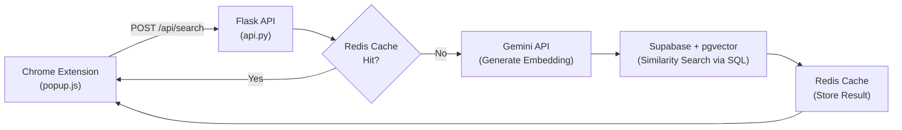

# Vector Search Migration Plan
## From Local Browser AI → Backend pgvector Infrastructure

> **Goal:** Move all embedding generation and similarity search off the browser extension and onto the Python backend. This fixes the UI freeze, enables massive scale, and builds the foundation for production-grade vector search.

---

## Table of Contents
1. [Why We're Doing This](#1-why-were-doing-this)
2. [Architecture Overview](#2-architecture-overview)
3. [FAISS vs pgvector vs Others (Comparison)](#3-faiss-vs-pgvector-vs-others)
4. [Why pgvector Wins For Us](#4-why-pgvector-wins-for-us)
5. [Design Decisions](#5-design-decisions)
6. [Files to Modify](#6-files-to-modify)
7. [Files to Create](#7-files-to-create)
8. [Files to Remove / Deprecate](#8-files-to-remove--deprecate)
9. [New Dependencies](#9-new-dependencies)
10. [Phase-by-Phase Roadmap](#10-phase-by-phase-roadmap)
11. [API Contract](#11-api-contract)
12. [Verification Plan](#12-verification-plan)

---

## 1. Why We're Doing This

### The Current Problem
Right now, the Chrome extension does **everything locally**:
- Downloads a **30-50MB AI model** (`all-MiniLM-L6-v2`) into the browser
- Runs that model on the **main UI thread** (because Chrome disables Web Workers for extensions)
- Loops through **every memory** in JavaScript to calculate similarity scores

This causes the **UI to freeze** because the browser can't handle button clicks and AI math at the same time. It also **can't scale** beyond a few hundred memories.

### What We're Building
A **"Thin Client"** architecture where:
- The extension just **sends a search query** to the backend (a tiny network request)
- The backend uses **pgvector** (a PostgreSQL extension) to search vectors directly inside our existing Supabase database
- The backend uses **Gemini's free API** to generate high-quality embeddings (no model download needed)
- Results come back quickly and the UI stays perfectly smooth

---

## 2. Architecture Overview

### Before (Current)
```
User types in search bar
  → Browser downloads 50MB AI model
  → Browser generates embedding on main thread (FREEZE)
  → Browser loops through ALL memories doing math (FREEZE)
  → Results finally appear
```

### After (Target)
```
User types in search bar
  → Extension sends query to Backend API
  → Backend generates embedding via Gemini (fast, free, no download)
  → Backend searches Supabase using pgvector SQL (milliseconds)
  → Backend checks Redis cache first (instant if cached)
  → Results returned to Extension
  → UI stays smooth the entire time
```

### System Diagram


---

## 3. FAISS vs pgvector vs Others

| Feature | **pgvector (Supabase)** | **FAISS** | **Pinecone** | **Qdrant** |
|---------|----------------------|-----------|-------------|------------|
| **Cost** | **$0** (already on Supabase) | $0 library, but needs persistent disk ($7+/mo on Render) | Free tier limited, then $70+/mo | Self-hosted = free, cloud = paid |
| **New Infrastructure** | **None** (same DB as memories) | Need file storage solution | New managed service | New server/service |
| **Persistence** | **Built-in** (it's a database) | Files on disk — ephemeral on Render free tier | Managed | Managed or self-hosted |
| **Filtering** | **SQL WHERE clauses** (filter by platform, date, user — for free) | Manual: maintain separate metadata mapping | Metadata filtering | Filtering API |
| **Delete a user's data** | **`DELETE FROM ... WHERE uuid = X`** | Delete a file from disk | API call | API call |
| **Scale** | Good up to ~500K vectors per table | Excellent (billions) | Excellent | Excellent |
| **Search Speed** | ~5-50ms for <100K vectors | ~1-5ms | ~10-50ms | ~5-20ms |
| **Setup Difficulty** | **Easy** — enable extension, add column, create index | Medium — manage index files, persistence | Easy — but external service | Medium |

---

## 4. Why pgvector Wins For Us

> [!IMPORTANT]
> **The #1 reason: We're already on Supabase (PostgreSQL), and pgvector is a free built-in extension.** Zero new infrastructure. Zero new cost. Zero persistent disk headaches.

### The Killer Advantages

1. **Memories and embeddings live in the SAME table.** No syncing between two systems. When you `INSERT` a memory, the embedding goes in the same row. When you `DELETE` a memory, the embedding is gone too. No orphaned data.

2. **SQL filtering is free.** Want to search only memories from "chatgpt" created this week? With FAISS, you'd have to build a custom filter layer. With pgvector, it's just:
   ```sql
   SELECT * FROM memories
   WHERE uuid = 'user-123'
     AND platform = 'chatgpt'
     AND timestamp > '2026-02-01'
   ORDER BY embedding <=> query_embedding
   LIMIT 10;
   ```

3. **No persistent disk problem on Render.** FAISS stores indexes as files that disappear on Render's free tier. pgvector stores everything in Supabase's managed PostgreSQL — always available, always persistent.

4. **User data deletion is trivial.** `DELETE FROM memories WHERE uuid = 'user-123'` wipes everything — text AND embeddings — in one query. No separate FAISS file to manage.

5. **Scales enough for us.** pgvector handles up to ~500K vectors per table comfortably. With 1,000 users × 1,000 memories each, that's only 1M vectors — well within range with proper indexing.

### When Would FAISS Be Better?
FAISS would only be the better choice if we were dealing with **tens of millions of vectors** or needed **sub-millisecond search**. For our current and near-future scale, pgvector is simpler, cheaper, and more maintainable.


---

## 5. Design Decisions

| Decision | Choice | Why |
|----------|--------|-----|
| **Embedding Model** | Gemini `text-embedding-004` (768-dim, free tier) | Free, high quality, no download needed |
| **Vector Search** | pgvector on Supabase (IVFFlat index) | Already on Supabase, zero new cost, SQL filtering |
| **Caching** | Redis (already set up) | Cache repeated searches for instant responses |
| **API Framework** | Flask (already in use) | Just add new endpoints |
| **Fallback** | Keep keyword search as backup | If Gemini API is down, fall back to TF-IDF in [search_engine.py](file:///c:/Users/Abdel/OneDrive/MemoryBox/Memory_Box_Website/backend/search_engine.py) |

---

## 6. Files to Modify

### Backend (Python)

#### [MODIFY] [api.py](file:///c:/Users/Abdel/OneDrive/MemoryBox/Memory_Box_Website/backend/api.py)
- Add 3 new API endpoints:
  - `POST /api/search` — Main search endpoint
  - `POST /api/embeddings/generate` — Generate and store embedding for a memory
  - `POST /api/embeddings/batch` — Batch process multiple memories
- Import the new `vector_search.py` module

#### [MODIFY] [memories.py](file:///c:/Users/Abdel/OneDrive/MemoryBox/Memory_Box_Website/backend/memories.py)
- Update [add_memory()](file:///c:/Users/Abdel/OneDrive/MemoryBox/Memory_Box_Website/backend/memories.py#61-71) to also generate and store an embedding when a new memory is saved
- Add an `embedding` column (type `vector(768)`) to the [memories](file:///c:/Users/Abdel/OneDrive/MemoryBox/Memory_Box_Website/backend/memories.py#20-32) table in Supabase

#### [MODIFY] [redis_cache.py](file:///c:/Users/Abdel/OneDrive/MemoryBox/Memory_Box_Website/backend/redis_cache.py)
- Add search-specific caching:
  - `set_search_cache(user_id, query_hash, results, ttl=300)`
  - `get_search_cache(user_id, query_hash)`
  - `invalidate_user_search_cache(user_id)`

#### [MODIFY] [requirements.txt](file:///c:/Users/Abdel/OneDrive/MemoryBox/Memory_Box_Website/backend/requirements.txt)
- Add: `google-genai` (or `google-generativeai`), `numpy`

### Frontend (Chrome Extension)

#### [MODIFY] [popup.js](file:///c:/Users/Abdel/OneDrive/MemoryBox/AI_shared_memory/src/popup.js)
- **Remove:** The entire [VectorMemoryClassifier](file:///c:/Users/Abdel/OneDrive/MemoryBox/AI_shared_memory/src/popup.js#181-931) class (lines 181-930)
- **Remove:** The `@xenova/transformers` import
- **Add:** A lightweight `BackendSearchClient` that calls the new API endpoints
- **Modify:** Search bar listener → call `BackendSearchClient.search()` instead of local AI

#### [MODIFY] [memoryDB.js](file:///c:/Users/Abdel/OneDrive/MemoryBox/AI_shared_memory/src/memoryDB.js)
- Remove embedding-related stats from [getStats()](file:///c:/Users/Abdel/OneDrive/MemoryBox/AI_shared_memory/src/memoryDB.js#581-613)
- Stop storing `embedding` field in local IndexedDB (saves space)

---

## 7. Files to Create

### Backend (Python)

#### [NEW] `vector_search.py`
**Location:** [vector_search.py](file:///c:/Users/Abdel/OneDrive/MemoryBox/Memory_Box_Website/backend/vector_search.py)

The core module for all vector operations:
```python
# Generate an embedding using Gemini free API
def generate_embedding(text: str) -> list[float]

# Search memories by vector similarity using pgvector SQL
def search_similar(user_id: str, query_text: str, top_k: int = 10, filters: dict = None) -> list[dict]

# Generate and store embedding for a single memory
def embed_memory(user_id: str, message_id: str, content: str)

# Batch embed multiple memories
def batch_embed_memories(user_id: str, memory_ids: list[str])
```

#### [NEW] `embedding_pipeline.py`
**Location:** [embedding_pipeline.py](file:///c:/Users/Abdel/OneDrive/MemoryBox/Memory_Box_Website/backend/embedding_pipeline.py)

Handles chunking and deduplication:
```python
def chunk_text(text: str, chunk_size: int = 512, overlap: int = 50) -> list[str]
def is_duplicate(user_id: str, embedding: list[float], threshold: float = 0.95) -> bool
def process_memory(user_id: str, memory: dict) -> dict
def migrate_user_memories(user_id: str) -> dict
```

### Frontend (JavaScript)

#### [NEW] `backendSearch.js`
**Location:** [backendSearch.js](file:///c:/Users/Abdel/OneDrive/MemoryBox/AI_shared_memory/src/backendSearch.js)

Lightweight API client replacing the heavy local AI:
```javascript
class BackendSearchClient {
  async search(query, options = {}) { ... }   // Call POST /api/search
  async embedMemory(memoryId, content) { ... } // Call POST /api/embeddings/generate
  async batchEmbed(memoryIds) { ... }          // Call POST /api/embeddings/batch
}
```

---

## 8. Files to Remove / Deprecate

| File | Action | Reason |
|------|--------|--------|
| [VectorMemoryClassifier](file:///c:/Users/Abdel/OneDrive/MemoryBox/AI_shared_memory/src/popup.js#181-931) in [popup.js](file:///c:/Users/Abdel/OneDrive/MemoryBox/AI_shared_memory/src/popup.js) (lines 181-930) | **Remove** | Local AI that causes freeze. Replaced by backend. |
| `@xenova/transformers` import in [popup.js](file:///c:/Users/Abdel/OneDrive/MemoryBox/AI_shared_memory/src/popup.js) | **Remove** | No longer needed — saves ~30MB from bundle. |
| [vectorClassifier.js](file:///c:/Users/Abdel/OneDrive/MemoryBox/AI_shared_memory/src/vectorClassifier.js) | **Deprecate** | Standalone local AI. No longer imported. |
| [search_engine.py](file:///c:/Users/Abdel/OneDrive/MemoryBox/Memory_Box_Website/backend/search_engine.py) | **Keep as fallback** | TF-IDF backup if Gemini API goes down. |

---

## 9. New Dependencies

### Python (Backend)
| Package | Purpose |
|---------|---------|
| `google-genai` | Gemini API client for embedding generation (free tier) |
| `numpy` | Array operations for embedding handling |

### JavaScript (Frontend)
| Package | Action | Purpose |
|---------|--------|---------|
| `@xenova/transformers` | **Remove** | Saves ~30MB from extension bundle |

### Supabase (Database)
| Change | Purpose |
|--------|---------|
| Enable `vector` extension in Supabase dashboard | Activates pgvector |
| Add `embedding vector(768)` column to [memories](file:///c:/Users/Abdel/OneDrive/MemoryBox/Memory_Box_Website/backend/memories.py#20-32) table | Stores embeddings alongside memory text |
| Create IVFFlat index on the embedding column | Fast similarity search |

---

## 10. Phase-by-Phase Roadmap

### Phase 1: Supabase + pgvector Setup (Day 1)
- [ ] Enable `vector` extension in Supabase dashboard
- [ ] Add `embedding vector(768)` column to [memories](file:///c:/Users/Abdel/OneDrive/MemoryBox/Memory_Box_Website/backend/memories.py#20-32) table
- [ ] Create an IVFFlat index: `CREATE INDEX ON memories USING ivfflat (embedding vector_cosine_ops) WITH (lists = 100);`
- [ ] Set up Gemini API key in `secrets.env`

### Phase 2: Backend Search API (Days 2-3)
- [ ] Create `vector_search.py` with `generate_embedding()` and `search_similar()`
- [ ] Add `POST /api/search` endpoint to [api.py](file:///c:/Users/Abdel/OneDrive/MemoryBox/Memory_Box_Website/backend/api.py)
- [ ] Add `POST /api/embeddings/generate` endpoint to [api.py](file:///c:/Users/Abdel/OneDrive/MemoryBox/Memory_Box_Website/backend/api.py)
- [ ] Test via Postman: send a query, get ranked results back

### Phase 3: Frontend Migration (Days 4-5)
- [ ] Create `backendSearch.js`
- [ ] Modify [popup.js](file:///c:/Users/Abdel/OneDrive/MemoryBox/AI_shared_memory/src/popup.js): remove [VectorMemoryClassifier](file:///c:/Users/Abdel/OneDrive/MemoryBox/AI_shared_memory/src/popup.js#181-931), wire search bar to backend
- [ ] Remove `@xenova/transformers` import
- [ ] Test: search bar → no freeze → results appear from backend

### Phase 4: Auto-Embed + Redis Caching (Days 6-7)
- [ ] Modify [memories.py](file:///c:/Users/Abdel/OneDrive/MemoryBox/Memory_Box_Website/backend/memories.py) to auto-generate embeddings on [add_memory()](file:///c:/Users/Abdel/OneDrive/MemoryBox/Memory_Box_Website/backend/memories.py#61-71)
- [ ] Extend [redis_cache.py](file:///c:/Users/Abdel/OneDrive/MemoryBox/Memory_Box_Website/backend/redis_cache.py) with search-specific cache functions
- [ ] Add `POST /api/embeddings/batch` for migrating existing memories
- [ ] Test: add a memory → immediately searchable

### Phase 5: Optimization + Cleanup (Days 8-10)
- [ ] Create `embedding_pipeline.py` with chunking and dedup
- [ ] Add performance logging (p95 latency per search)
- [ ] Clean up: remove [vectorClassifier.js](file:///c:/Users/Abdel/OneDrive/MemoryBox/AI_shared_memory/src/vectorClassifier.js), embedding logic from [memoryDB.js](file:///c:/Users/Abdel/OneDrive/MemoryBox/AI_shared_memory/src/memoryDB.js)
- [ ] Stress test with synthetic data

---

## 11. API Contract

### `POST /api/search`
**Request:**
```json
{
  "uuid": "user-uuid",
  "query": "how to set up a React project",
  "top_k": 10,
  "filters": {
    "platform": "chatgpt",
    "date_from": "2026-01-01"
  }
}
```
**Response:**
```json
{
  "results": [
    {
      "message_id": "abc123",
      "content": "To create a React app, run npx create-react-app...",
      "similarity": 0.92,
      "platform": "chatgpt",
      "timestamp": "2026-01-15T10:30:00Z"
    }
  ],
  "total": 1,
  "latency_ms": 45,
  "cache_hit": false
}
```

### `POST /api/embeddings/generate`
**Request:**
```json
{ "uuid": "user-uuid", "message_id": "abc123", "content": "The text content..." }
```
**Response:**
```json
{ "status": "success", "message_id": "abc123", "dimensions": 768 }
```

### `POST /api/embeddings/batch`
**Request:**
```json
{ "uuid": "user-uuid", "memory_ids": ["abc123", "def456"] }
```
**Response:**
```json
{ "status": "success", "processed": 2, "failed": 0, "total_time_ms": 800 }
```

---

## 12. Verification Plan

### Performance Benchmarks
| Metric | Current (Local) | Target (pgvector) |
|--------|-----------------|-------------------|
| **Search Latency (p95)** | 2-5 seconds (or freeze) | < 50ms |
| **UI Responsiveness** | Freezes during search | Zero lag |
| **Cache Hit Latency** | N/A | < 10ms |
| **Max Memories** | ~200 before crash | 100,000+ |

### Tests
- [ ] Search 5 queries rapidly — UI never lags
- [ ] Search with filters (platform, date) — correct results
- [ ] Add a new memory → immediately searchable
- [ ] Delete a memory → no longer appears in search
- [ ] Clear all user data → everything gone (text + embeddings)
