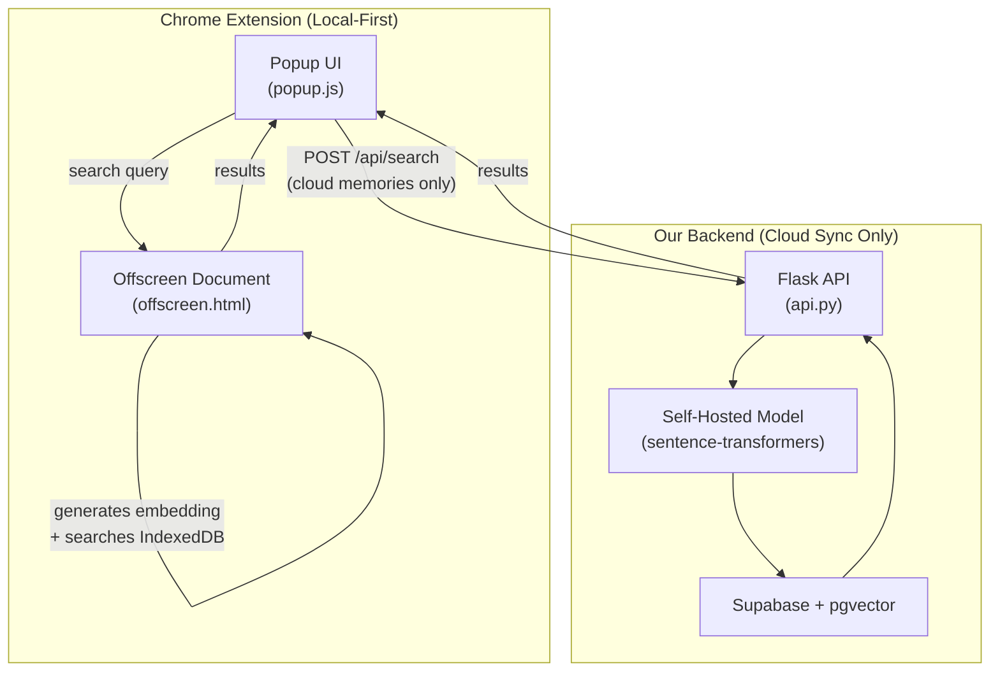

# Vector Search Migration Plan (v3)
## Local-First, Privacy-Respecting Architecture

> **CEO Feedback Addressed:**
> 1. ~~Supabase is for ALL memories~~ → Supabase is only for **cloud-synced** memories. Local memories stay in IndexedDB.
> 2. ~~Send data to Gemini/OpenAI~~ → **No third-party API calls.** Embeddings are generated locally or on our own server.

---

## The Two Problems & Solutions

### Problem 1: "Supabase is only for cloud-synced memories"

Most memories live **locally in IndexedDB** and never touch Supabase. So pgvector on Supabase only helps the subset of cloud-synced memories.

**Solution: Hybrid architecture** — two search paths depending on where the data lives.

### Problem 2: "No data sent to third parties"

The extension's brand promise is **local-first, private, no third-party data sharing.** Calling Gemini or OpenAI to generate embeddings breaks this promise.

**Solution: Self-hosted embeddings everywhere.**
- **Local memories → Chrome Offscreen Document** runs the same Xenova model, but in a **hidden background page** that doesn't freeze the popup UI.
- **Cloud memories → Self-hosted `sentence-transformers`** model running on our own Render backend. Data goes to *our server* (which it already does for cloud sync), never to Google or OpenAI.

---

## Architecture Overview

```
LOCAL MEMORIES (never leave the browser):
  User types search → Popup sends query to Offscreen Document
    → Offscreen Document generates embedding (background, no freeze)
    → Offscreen Document searches local IndexedDB embeddings
    → Results sent back to Popup via chrome.runtime messaging
    → UI stays smooth ✅  No data sent anywhere ✅

CLOUD-SYNCED MEMORIES (already on our server):
  User searches cloud memories → Extension calls POST /api/search
    → Our Flask server generates embedding (self-hosted model)
    → Server searches pgvector on Supabase
    → Results returned to Extension
    → No third parties involved ✅
```

### System Diagram


---

## What is an Offscreen Document? (Simple Explanation)

Chrome's **Offscreen Document API** creates a **hidden HTML page** that runs in the background. Think of it like a secret invisible tab that the extension controls.

- **It has its own thread** — the heavy math runs there, not in the popup
- **The popup stays smooth** — it just sends a message ("search for X") and waits for results
- **No data leaves the browser** — everything happens locally
- **Available in Manifest V3** — which we already use

This is the Chrome-approved way to run heavy computation in extensions. It's specifically designed for use cases like ours.

---

## What Changes From the Previous Plan

| Aspect | Previous Plan ❌ | Updated Plan ✅ |
|--------|-----------------|----------------|
| **Local memory search** | Send to backend (Gemini API) | **Offscreen Document** (stays in browser) |
| **Embedding generation** | Gemini free tier (third-party) | **Xenova model in Offscreen Doc** (local) + **self-hosted model** (cloud) |
| **Privacy** | Data sent to Google | **Zero third-party data sharing** |
| **Cloud memory search** | pgvector via Gemini embeddings | pgvector via **self-hosted model** embeddings |
| **New dependencies** | `google-genai` | `sentence-transformers` (backend only) |

---

## Files to Modify

### Frontend (Chrome Extension)

#### [MODIFY] [popup.js](file:///c:/Users/Abdel/OneDrive/MemoryBox/AI_shared_memory/src/popup.js)
- **Remove:** [VectorMemoryClassifier](file:///c:/Users/Abdel/OneDrive/MemoryBox/AI_shared_memory/src/popup.js#181-931) class (lines 181-930) and `@xenova/transformers` import
- **Add:** Message-based search that sends queries to the Offscreen Document
- The popup becomes a "thin UI" — it sends `{ action: 'search', query: '...' }` and receives results

#### [MODIFY] [manifest.json](file:///c:/Users/Abdel/OneDrive/MemoryBox/AI_shared_memory/public/manifest.json)
- **Add:** `"offscreen"` permission
- The Offscreen Document HTML file needs to be declared

#### [MODIFY] [memoryDB.js](file:///c:/Users/Abdel/OneDrive/MemoryBox/AI_shared_memory/src/memoryDB.js)
- Keep the `embedding` field in IndexedDB (still needed for local search)
- Add a method to search by embedding similarity (moved from popup.js)

### Backend (Python)

#### [MODIFY] [api.py](file:///c:/Users/Abdel/OneDrive/MemoryBox/Memory_Box_Website/backend/api.py)
- Add `POST /api/search` endpoint (for cloud-synced memories only)
- Add `POST /api/embeddings/generate` endpoint

#### [MODIFY] [memories.py](file:///c:/Users/Abdel/OneDrive/MemoryBox/Memory_Box_Website/backend/memories.py)
- Update [add_memory()](file:///c:/Users/Abdel/OneDrive/MemoryBox/Memory_Box_Website/backend/memories.py#61-71) to auto-generate embedding when a memory is cloud-synced
- Requires `embedding vector(768)` column in Supabase [memories](file:///c:/Users/Abdel/OneDrive/MemoryBox/Memory_Box_Website/backend/memories.py#20-32) table

#### [MODIFY] [requirements.txt](file:///c:/Users/Abdel/OneDrive/MemoryBox/Memory_Box_Website/backend/requirements.txt)
- Add: `sentence-transformers`, `numpy`, `torch` (CPU-only)

#### [MODIFY] [redis_cache.py](file:///c:/Users/Abdel/OneDrive/MemoryBox/Memory_Box_Website/backend/redis_cache.py)
- Add search-specific caching functions for cloud memory searches

---

## Files to Create

### Frontend

#### [NEW] `offscreen.html`
Simple HTML file that loads the embedding worker script. Declared in manifest.json.

#### [NEW] `offscreen.js`
The "brain" that runs in the background:
```javascript
// Listens for messages from popup/service worker
chrome.runtime.onMessage.addListener((msg, sender, sendResponse) => {
  if (msg.action === 'search') {
    handleSearch(msg.query, msg.memories).then(sendResponse);
    return true; // async response
  }
  if (msg.action === 'generate_embedding') {
    generateEmbedding(msg.text).then(sendResponse);
    return true;
  }
  if (msg.action === 'batch_process') {
    batchProcess(msg.memories).then(sendResponse);
    return true;
  }
});
```
- Loads `@xenova/transformers` (model download happens here, not in popup)
- Generates embeddings in the background
- Performs similarity search against provided memories
- **No UI freeze** because this runs in a separate document

### Backend

#### [NEW] `vector_search.py`
Self-hosted embedding generation + pgvector search:
```python
from sentence_transformers import SentenceTransformer

# Load the SAME model we use locally — keeps embeddings compatible
model = SentenceTransformer('all-MiniLM-L6-v2')

def generate_embedding(text: str) -> list[float]:
    return model.encode(text).tolist()

def search_cloud_memories(user_id, query, top_k=10, filters=None):
    query_embedding = generate_embedding(query)
    # pgvector SQL search on Supabase
    ...
```

---

## Files to Remove / Deprecate

| File | Action | Reason |
|------|--------|--------|
| [VectorMemoryClassifier](file:///c:/Users/Abdel/OneDrive/MemoryBox/AI_shared_memory/src/popup.js#181-931) in [popup.js](file:///c:/Users/Abdel/OneDrive/MemoryBox/AI_shared_memory/src/popup.js) | **Remove** | Replaced by Offscreen Document |
| `@xenova/transformers` import in [popup.js](file:///c:/Users/Abdel/OneDrive/MemoryBox/AI_shared_memory/src/popup.js) | **Move** to `offscreen.js` | Model runs in background, not popup |
| [vectorClassifier.js](file:///c:/Users/Abdel/OneDrive/MemoryBox/AI_shared_memory/src/vectorClassifier.js) | **Deprecate** | Logic absorbed into `offscreen.js` |

---

## New Dependencies

### Python (Backend)
| Package | Purpose |
|---------|---------|
| `sentence-transformers` | Self-hosted embedding model (same as Xenova, Python version) |
| `numpy` | Array operations |
| `torch` (CPU) | Required by sentence-transformers |

### JavaScript (Frontend)
| Change | Purpose |
|--------|---------|
| `@xenova/transformers` **moves** from popup.js → offscreen.js | Same library, different location — no longer blocks UI |

### Supabase (Database)
| Change | Purpose |
|--------|---------|
| Enable `vector` extension | Activate pgvector for cloud memories |
| Add `embedding vector(384)` column to [memories](file:///c:/Users/Abdel/OneDrive/MemoryBox/Memory_Box_Website/backend/memories.py#20-32) table | Store embeddings for cloud-synced memories |

> [!NOTE]
> Dimension is **384** (not 768) because `all-MiniLM-L6-v2` outputs 384-dim vectors. We keep the same model locally and on the backend for **embedding compatibility**.

---

## Phase-by-Phase Roadmap

### Phase 1: Offscreen Document (Days 1-3) — **Fixes the Freeze**
- [ ] Create `offscreen.html` and `offscreen.js`
- [ ] Move `@xenova/transformers` and embedding logic into `offscreen.js`
- [ ] Update [manifest.json](file:///c:/Users/Abdel/OneDrive/MemoryBox/AI_shared_memory/public/manifest.json) with `"offscreen"` permission
- [ ] Modify [popup.js](file:///c:/Users/Abdel/OneDrive/MemoryBox/AI_shared_memory/src/popup.js) to send search requests via `chrome.runtime.sendMessage`
- [ ] Test: search bar → no freeze → results appear from background

### Phase 2: Cloud Search Backend (Days 4-6)
- [ ] Install `sentence-transformers` on backend
- [ ] Create `vector_search.py` with self-hosted model
- [ ] Enable pgvector in Supabase, add embedding column
- [ ] Add `POST /api/search` endpoint for cloud memories
- [ ] Test: cloud-synced memories are searchable from the backend

### Phase 3: Auto-Embed + Caching (Days 7-8)
- [ ] Auto-generate embedding when memory is cloud-synced via [add_memory()](file:///c:/Users/Abdel/OneDrive/MemoryBox/Memory_Box_Website/backend/memories.py#61-71)
- [ ] Add Redis caching for cloud search results
- [ ] Add cache invalidation on memory add/delete
- [ ] Test: sync a memory → immediately searchable in cloud

### Phase 4: Optimization + Cleanup (Days 9-10)
- [ ] Batch processing in Offscreen Document (process memories in background)
- [ ] Performance logging (p95 latency for both local and cloud search)
- [ ] Clean up dead code from [popup.js](file:///c:/Users/Abdel/OneDrive/MemoryBox/AI_shared_memory/src/popup.js)
- [ ] Stress test with large memory sets

---

## Verification Plan

| Metric | Current | Target |
|--------|---------|--------|
| **Local Search (popup freeze)** | 2-5 sec freeze | **Zero freeze** (Offscreen Document) |
| **Cloud Search Latency** | N/A (not implemented) | **< 100ms** |
| **Privacy** | Local model ✅ | **Still local** ✅ + self-hosted backend ✅ |
| **Third-party data sharing** | None | **Still none** ✅ |
| **Extension bundle size** | ~30MB (Xenova in popup) | **Same** (Xenova in offscreen) |

### Key Tests
- [ ] Search rapidly — popup UI never lags or freezes
- [ ] Disconnect internet → local search still works perfectly
- [ ] Network monitor → confirm zero calls to Google, OpenAI, or any third-party during local search
- [ ] Cloud search returns results with correct similarity ranking
- [ ] Delete a memory → no longer appears in either local or cloud search
